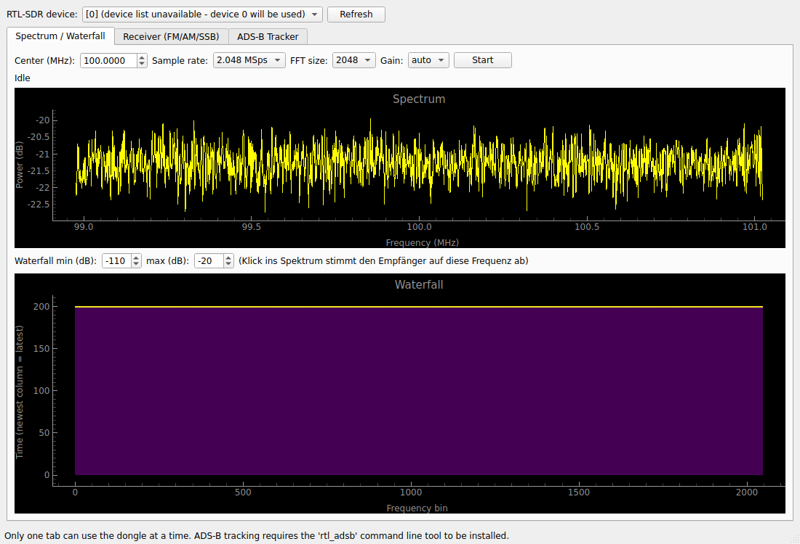

# RTL-SDR Suite

[](https://github.com/ziegemann83/rtlsdr-suite/actions/workflows/tests.yml)
[](https://github.com/ziegemann83/rtlsdr-suite/actions/workflows/release.yml)
[](LICENSE)

Eine kleine Desktop-Anwendung (Python + PySide6) für RTL-SDR-USB-Dongles mit drei
Werkzeugen in einem Fenster:

1. **Spektrum / Wasserfall** – Live-Frequenzspektrum und scrollendes Wasserfalldiagramm,
   Klick ins Spektrum stimmt den Empfänger direkt auf diese Frequenz ab.
2. **Empfänger** – Allgemeiner Empfang mit WFM (UKW-Radio), NFM, AM, USB und LSB,
   Lautstärke- und Squelch-Regler, Live-Audioausgabe, Aufnahme als WAV-Datei und
   ein Frequenz-Presets-Speicher.
3. **ADS-B Flugzeug-Tracker** – Empfängt 1090-MHz-ADS-B-Signale, dekodiert ICAO,
   Rufzeichen, Höhe, Geschwindigkeit, Kurs, Steigrate und Position, zeigt alle
   aktiven Flugzeuge in einer Tabelle, kann Sichtungen als CSV loggen und eine
   interaktive Karte (Leaflet/OpenStreetMap) im Browser öffnen.

Da an einem USB-Dongle immer nur ein Programm gleichzeitig Daten abgreifen kann,
teilen sich die drei Tabs das Gerät: Es kann immer nur ein Tab gleichzeitig aktiv
sein (die App verhindert das automatisch und zeigt einen Hinweis, falls man das
versucht). Zuletzt genutzte Frequenz, Modus, Gain, Lautstärke, Squelch und das
ausgewählte Gerät werden automatisch gespeichert und beim nächsten Start wieder
geladen.



## Fertige Programme (ohne Python-Installation)

Unter [Releases](../../releases) gibt es fertig gebaute, eigenständige
Programme für Windows (`RTLSDRSuite-windows.exe`), macOS
(`RTLSDRSuite-macos`) und Linux (`RTLSDRSuite-linux`) – kein lokales Python
nötig. Es wird trotzdem weiterhin der RTL-SDR-Treiber (librtlsdr) benötigt,
siehe unten. Unter macOS muss die Datei beim ersten Start ggf. über
Rechtsklick → "Öffnen" freigegeben werden (Gatekeeper, da die Datei nicht
signiert ist). Unter Linux muss die Datei vor dem ersten Start ausführbar
gemacht werden: `chmod +x RTLSDRSuite-linux`.

Diese Binaries werden automatisch von GitHub Actions gebaut, sobald ein
Versions-Tag (`vX.Y.Z`) gepusht wird – siehe
`.github/workflows/release.yml`. Bei jedem Push auf `main` läuft außerdem
automatisch die Testsuite (`.github/workflows/tests.yml`).

## Voraussetzungen

* Python 3.10 oder neuer (nur für den Start aus dem Quellcode nötig)
* Ein RTL-SDR-USB-Dongle (RTL2832U-Chipsatz) mit installierten Treibern
  (unter Windows z. B. über Zadig den WinUSB-Treiber installieren, siehe
  https://www.rtl-sdr.com/rtl-sdr-quick-start-guide/)
* Für den ADS-B-Tab zusätzlich die `rtl-sdr`-Kommandozeilenwerkzeuge
  (liefern u. a. `rtl_adsb`, `rtl_test`, `rtl_fm`):
  - Linux: `sudo apt install rtl-sdr` (Debian/Ubuntu) oder das Äquivalent
    Ihrer Distribution
  - macOS: `brew install librtlsdr`
  - Windows: die vorgebauten Binaries von osmocom/rtl-sdr herunterladen und
    den Ordner zum `PATH` hinzufügen

## Installation

```bash
python -m venv venv
# Linux/macOS:
source venv/bin/activate
# Windows (PowerShell):
venv\Scripts\Activate.ps1

pip install -r requirements.txt
```

## Start

```bash
python main.py
```

Beim Start sollte der Dongle bereits eingesteckt sein. Über "Refresh" in der
Kopfzeile lässt sich die Geräteliste neu einlesen, falls mehrere Dongles
angeschlossen sind. Das zuletzt genutzte Gerät wird automatisch wieder
ausgewählt.

## Bedienung

### Spektrum / Waterfall
Mittenfrequenz, Samplerate, FFT-Größe und Gain einstellen, dann "Start"
klicken. Das obere Diagramm zeigt das aktuelle Spektrum, das untere den
zeitlichen Verlauf als Wasserfall. Die Farbskala des Wasserfalls (min/max dB)
lässt sich über zwei Spinboxen anpassen. Ein Klick ins Spektrum-Diagramm
stimmt den Empfänger-Tab direkt auf die angeklickte Frequenz ab und wechselt
automatisch dorthin.

### Empfänger
Frequenz und Modus (WFM für UKW-Radio, NFM für Betriebsfunk/Amateurfunk-FM,
AM, USB/LSB für Kurzwelle) wählen, "Start" klicken. Lautstärke und Squelch
lassen sich live regeln. Mit "Record" wird die demodulierte Audiospur
gleichzeitig als WAV-Datei mitgeschnitten. Über "+ Speichern" lässt sich die
aktuelle Frequenz/Modus-Kombination als benannter Preset ablegen; Presets
werden per Doppelklick in der Liste geladen und über "- Entfernen" wieder
gelöscht.

### ADS-B Tracker
"Start ADS-B receiver" startet im Hintergrund `rtl_adsb` (muss auf dem PATH
liegen, siehe oben) und dekodiert die empfangenen Rohnachrichten mit der
Bibliothek [pyModeS](https://github.com/junzis/pyModeS). Für eine stabile
Positionsermittlung sollte die Antenne freie Sicht zum Himmel haben; auf
1090 MHz sendende Flugzeuge werden typischerweise aus 50–400 km Entfernung
empfangen, je nach Antenne und Standort.

"CSV-Log starten" schreibt jede neue Positions-/Statusmeldung fortlaufend in
eine CSV-Datei (Zeitstempel, ICAO, Rufzeichen, Höhe, Geschwindigkeit, Kurs,
Steigrate, Position) zur späteren Auswertung. "Karte im Browser öffnen"
erzeugt eine temporäre HTML-Seite mit einer interaktiven Leaflet/OpenStreetMap-
Karte und allen aktuell bekannten Flugzeugpositionen (benötigt eine
Internetverbindung zum Laden der Kartenkacheln).

## Tests

```bash
pip install pytest
pytest tests/
```

Die Testsuite deckt die Signalverarbeitung (Spektrum, FM/AM/SSB-Demodulation,
Dezimierung) und die ADS-B-Nachrichtenverarbeitung mit bekannten
Beispielnachrichten ab. Sie läuft automatisch bei jedem Push über GitHub
Actions.

## Projektstruktur

```
rtlsdr_suite/
  main_window.py      Hauptfenster, Tab-Verwaltung, Geräte-Sharing (DeviceHub)
  spectrum_tab.py      Spektrum-/Wasserfall-Tab
  receiver_tab.py      Empfänger-Tab (Demodulation, Audio, Aufnahme, Presets)
  adsb_tab.py          ADS-B-Tab (rtl_adsb-Subprozess, Tabelle, CSV-Log, Karte)
  sdr_device.py        Hintergrund-Thread, der den RTL-SDR-Dongle über pyrtlsdr ausliest
  dsp.py               Spektrum-Schätzung und Demodulatoren (FM/AM/SSB)
  audio_out.py         Audioausgabe über sounddevice
  adsb_decoder.py      Buchführung über erkannte Flugzeuge auf Basis von pyModeS
  settings.py          Persistente Einstellungen und Presets (QSettings)
tests/                 Automatisierte Tests (pytest)
assets/                App-Icon und Screenshot
main.py                Programmstart
requirements.txt       Python-Abhängigkeiten
```

## Bekannte Einschränkungen

* Es kann jeweils nur ein Tab gleichzeitig senden/empfangen, da nur ein
  Programm auf den USB-Dongle zugreifen kann.
* Die SSB-Demodulation filtert das unerwünschte Seitenband blockweise per FFT
  heraus; für den Amateurfunk-Alltag ausreichend, klingt an Blockgrenzen aber
  nicht ganz so sauber wie ein dedizierter SSB-Empfänger mit kontinuierlichem
  Filter.
* Der ADS-B-Tab benötigt das externe `rtl_adsb`-Tool; die Rohdemodulation der
  IQ-Daten wird bewusst nicht in Python neu implementiert, da die mitgelieferte
  C-Implementierung deutlich schneller und robuster ist.
* Die Windows-/macOS-Binaries sind nicht codesigniert (das würde ein
  kostenpflichtiges Zertifikat erfordern); SmartScreen bzw. Gatekeeper zeigen
  daher beim ersten Start eine Warnung.

## Lizenz

MIT, siehe [LICENSE](LICENSE).
